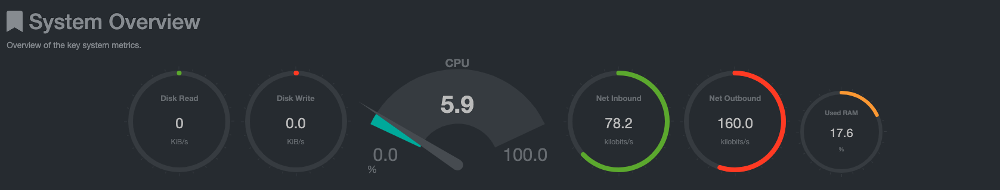

# Listes des ressources monitorés : 

- la CPU (Central Processing Unit)
- la RAM (Random Access Memory) 
- le Net Inboud/Outbound : les paquets qui entrent et quittent le serveur 
- le Disk Read/Write : lecture + écriture des informations sur le disque

